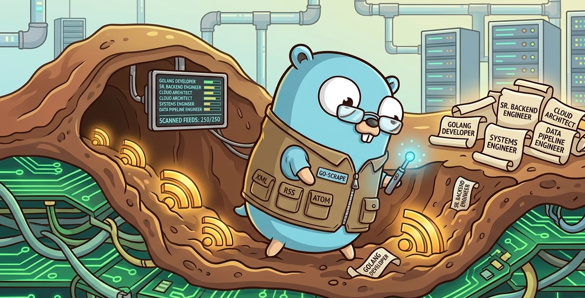
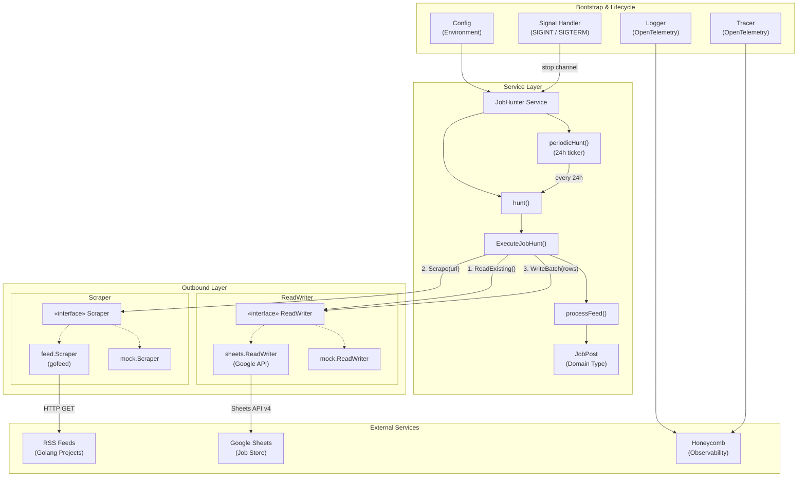

# scraper

  

## Architecture

```mermaid
graph TB
    subgraph External["External Services"]
        RSS["RSS Feeds<br/>(Golang Projects)"]
        Sheets["Google Sheets<br/>(Job Store)"]
        Honeycomb["Honeycomb<br/>(Observability)"]
    end

    subgraph Bootstrap["Bootstrap & Lifecycle"]
        Config["Config<br/>(Environment)"]
        Logs["Logger<br/>(OpenTelemetry)"]
        Traces["Tracer<br/>(OpenTelemetry)"]
        Signal["Signal Handler<br/>(SIGINT / SIGTERM)"]
    end

    subgraph Service["Service Layer"]
        JH["JobHunter Service"]
        Hunt["hunt()"]
        Periodic["periodicHunt()<br/>(24h ticker)"]
        Exec["ExecuteJobHunt()"]
        Process["processFeed()"]
        JobPost["JobPost<br/>(Domain Type)"]
    end

    subgraph Clients["Outbound Layer"]
        subgraph ScraperClient["Scraper"]
            ScraperIface["«interface» Scraper"]
            FeedImpl["feed.Scraper<br/>(gofeed)"]
            MockScraper["mock.Scraper"]
        end
        subgraph RWClient["ReadWriter"]
            RWIface["«interface» ReadWriter"]
            SheetsImpl["sheets.ReadWriter<br/>(Google API)"]
            MockRW["mock.ReadWriter"]
        end
    end

    Config --> JH
    Logs --> Honeycomb
    Traces --> Honeycomb
    Signal -->|"stop channel"| JH

    JH --> Hunt
    JH --> Periodic
    Periodic -->|"every 24h"| Hunt
    Hunt --> Exec

    Exec -->|"1. ReadExisting()"| RWIface
    Exec -->|"2. Scrape(url)"| ScraperIface
    Exec --> Process
    Process --> JobPost
    Exec -->|"3. WriteBatch(rows)"| RWIface

    ScraperIface -.-> FeedImpl
    ScraperIface -.-> MockScraper
    RWIface -.-> SheetsImpl
    RWIface -.-> MockRW

    FeedImpl -->|"HTTP GET"| RSS
    SheetsImpl -->|"Sheets API v4"| Sheets
```